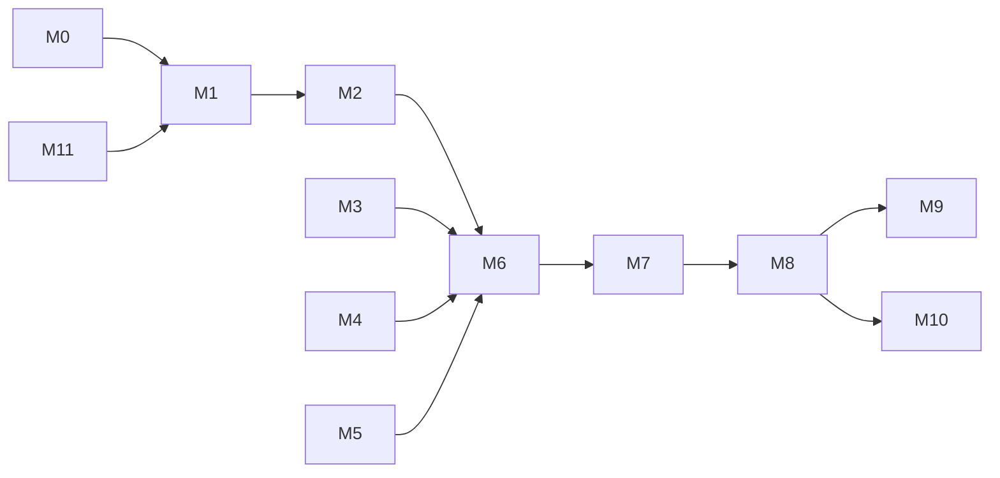

# AgriSat Risk — Module Development Plan

**Version:** 1.1 · aligned with SRS v2.0  
**Pilot scope:** Wheat · Matiari District · B2B decision-support only

---

## Module map

| # | Module | SRS refs | Status |
|---|--------|----------|--------|
| M0 | **Foundation** — repo, schema, env, docs | Done |
| M1 | **Auth & institutions** — register, invite, RLS, JWT | Done |
| M2 | **Field registration** — draw AOI, metadata, area validation | Done |
| M3 | **Tier 3 pipeline** — GEE Sentinel-1/2 + CHIRPS | Done (live GEE required) |
| M4 | **Tier 2 pipeline** — GEE weekly S2 composites (SEN2SR path) | Done (GEE composites; local model optional) |
| M5 | **Tier 1 pipeline** — PlanetScope E&R | Deferred (Tier 2/3 fallback sufficient for MVP) |
| M6 | **Fusion & storage** — tier selection, time-series persist | Done |
| M7 | **Baseline engine** — district GEE multi-year stats | Done |
| M8 | **Risk scoring** — z-score, rainfall cross-check, audit | Done |
| M9 | **Dashboard UI** — map, charts, flags, mobile | Done |
| M10 | **Reporting** — PDF field + portfolio, CSV export | Done |
| M11 | **Supabase production setup** — migrations, secrets, RLS test | Done |
| M12 | **ML layer (post-MVP)** — gradient-boosted model | Out of scope |

---

## Extras (post-module-plan)

| Feature | Status |
|---------|--------|
| Live GEE field imagery (RGB + NDVI preview) | Done |
| Matiari pilot migration (004) + baseline-per-tier (005) | Done |
| Vite dev proxy + imagery cache | Done |
| In-app Guide (`/guide`) — plain + technical documentation | Done |

---

## Per-module acceptance criteria

### M11 — Supabase setup
- [x] Migration SQL + geometry RPC helpers
- [x] Setup guide (`docs/SUPABASE-SETUP.md`)
- [x] Verify script (`scripts/verify_supabase.py`) + `/health/supabase`
- [x] Migrations 004–005 applied (pooler or SQL Editor)
- [x] RLS verified via `scripts/verify_rls.py` (API tenant isolation)

### M1 — Auth & institutions
- [x] Institution registration + JWT (JWKS + opaque keys)
- [x] Admin invite (`POST /auth/invite`) + Team page
- [x] Role-based nav (admin → Team)
- [x] Cross-tenant field access blocked (404)

### M3 — GEE Tier 3
- [x] Sentinel-2 NDVI/EVI + Sentinel-1 SAR + CHIRPS rainfall
- [x] `/health/gee` + `scripts/verify_gee.py`
- [x] No demo fallback — GEE required for field processing

### M4 — Tier 2
- [x] Weekly cloud-masked S2 composites via GEE
- [x] `/health/sen2sr` when `SEN2SR_ENABLED=true`
- [ ] Local SEN2SR model (optional future)

### M9 — Dashboard UI
- [x] Canopy design system · map-first layout
- [x] WCAG AA risk colors · mobile nav + portfolio cards
- [x] Satellite basemaps + draw tools + tile loading UX

### M10 — Reporting
- [x] Field PDF export
- [x] Portfolio CSV + PDF export (Overview + Portfolio pages)

---

## Out of scope (MVP)

- Farmer-facing app
- Automated insurance payout
- M5 PlanetScope (until E&R license confirmed)
- M12 supervised ML (FR-5.5)

---

## Dependency graph

