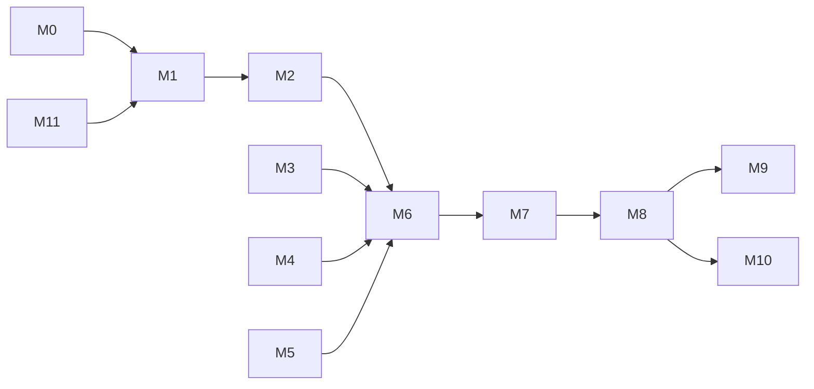

# AgriSat Risk — Module Development Plan

**Version:** 1.0 · aligned with SRS v2.0  
**Pilot scope:** Wheat · Matiari District · B2B decision-support only

---

## Module map

| # | Module | SRS refs | Branch (future work) | Status |
|---|--------|----------|----------------------|--------|
| M0 | **Foundation** — repo, schema, env, docs | All | `main` | Done (initial push) |
| M1 | **Auth & institutions** — register, invite, RLS, JWT | FR-1.x, NFR-4 | `feat/m1-auth-institutions` | Scaffold done |
| M2 | **Field registration** — draw AOI, metadata, area validation | FR-2.x | `feat/m2-field-registration` | Draw + GeoJSON/KML upload done |
| M3 | **Tier 3 pipeline** — GEE Sentinel-1/2 + CHIRPS | FR-3.1, FR-3.5–3.7 | `feat/m3-tier3-gee` | Demo data only |
| M4 | **Tier 2 pipeline** — SEN2SR super-resolution | FR-3.2, FR-3.4, NFR-6 | `feat/m4-tier2-sen2sr` | Stub |
| M5 | **Tier 1 pipeline** — PlanetScope E&R | FR-3.3, NFR-9 | `feat/m5-tier1-planet` | Stub (awaiting approval) |
| M6 | **Fusion & storage** — tier selection, time-series persist | FR-3.4, FR-3.8–3.9 | `feat/m6-fusion` | Core logic done |
| M7 | **Baseline engine** — multi-year, growth-stage stats | FR-4.x | `feat/m7-baseline` | Demo baseline done |
| M8 | **Risk scoring** — z-score, rainfall cross-check, audit | FR-5.1–5.4 | `feat/m8-risk-scoring` | Core done |
| M9 | **Dashboard UI** — map, charts, flags, list views | FR-6.x, NFR-1, NFR-8 | `feat/m9-dashboard-ui` | Canopy design system · pnpm |
| M10 | **Reporting** — PDF field report, CSV portfolio | FR-7.x | `feat/m10-reporting` | Basic export done |
| M11 | **Supabase production setup** — migrations, secrets, RLS test | NFR-4 | `chore/m11-supabase-setup` | Done (migrations + opaque key support) |
| M12 | **ML layer (post-MVP)** — gradient-boosted model | FR-5.5 | `feat/m12-ml-risk` | Planned |

---

## Recommended delivery order (next pushes)

```
Push 1 (initial)     → M0 on main
Push 2               → M11 Supabase wire-up + env docs ✅
Push 3               → M2 GeoJSON/KML upload + validation UX ✅
Push 4               → M3 GEE live Tier 3 (next)
Push 5               → M9 UI redesign (after design direction chosen)
Push 6               → M4 SEN2SR integration
Push 7               → M5 Planet Tier 1 (when E&R approved)
Push 8               → M10 report polish + portfolio PDF
```

Tier 3 (M3) before Tier 2/1 — matches SRS design rule FR-3.7.

---

## Per-module acceptance criteria

### M11 — Supabase setup
- [x] Migration SQL + geometry RPC helpers (`002_geometry_helpers.sql`, `003_postgis_schema_fix.sql`)
- [x] Setup guide (`docs/SUPABASE-SETUP.md`)
- [x] Verify script (`scripts/verify_supabase.py`) + `/health/supabase` endpoint
- [x] Migration applied on hosted project
- [x] PostGIS enabled + schema-qualified geometry functions
- [x] Opaque `sb_secret_*` / `sb_publishable_*` API key support in backend client
- [x] E2E flow test (`scripts/test_e2e_flows.py`) — register, login, field, reports
- [ ] RLS verified: institution A cannot read institution B fields

### M2 — Field upload
- [x] GeoJSON file upload
- [x] KML / simple coordinate list parse
- [x] Preview polygon on map before save

### M3 — GEE Tier 3
- [ ] Service account auth documented
- [ ] Sentinel-2 NDVI + Sentinel-1 VV backscatter per AOI
- [ ] CHIRPS rainfall anomaly for flag period
- [ ] Graceful fallback message if GEE unavailable (NFR-5)

### M9 — Dashboard UI (redesign)
- [ ] Distinct visual identity (not generic dark SaaS template)
- [ ] Map-first layout for loan officers
- [ ] Risk tier color system accessible (WCAG AA)
- [ ] Mobile/tablet usable in field-staff context (NFR-8)

---

## Dependency graph



---

## Out of scope (MVP)

- Farmer-facing app
- Automated insurance payout
- FR-5.5 supervised ML (M12)
- Commercial Planet licensing (NFR-9)
