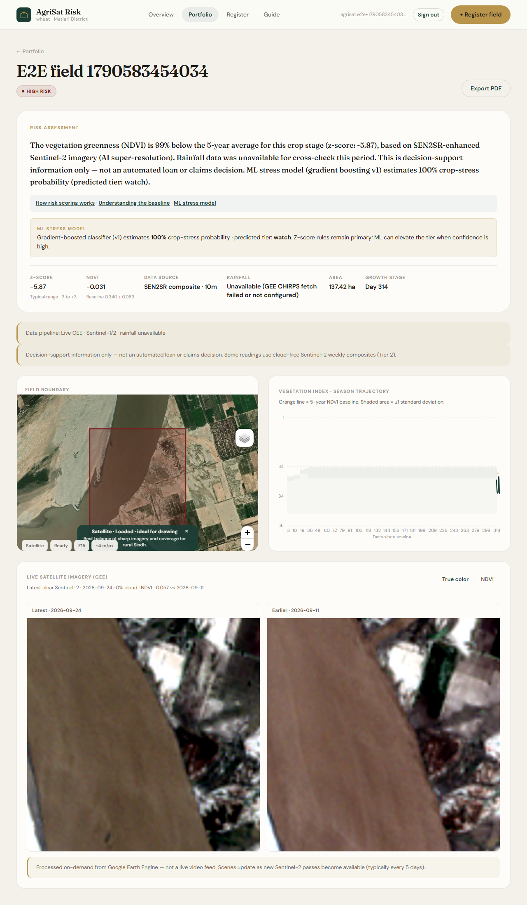
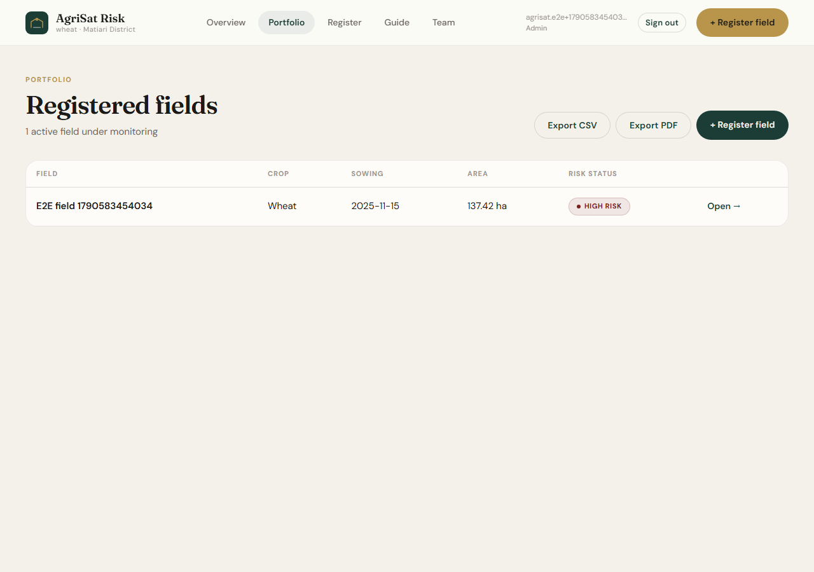
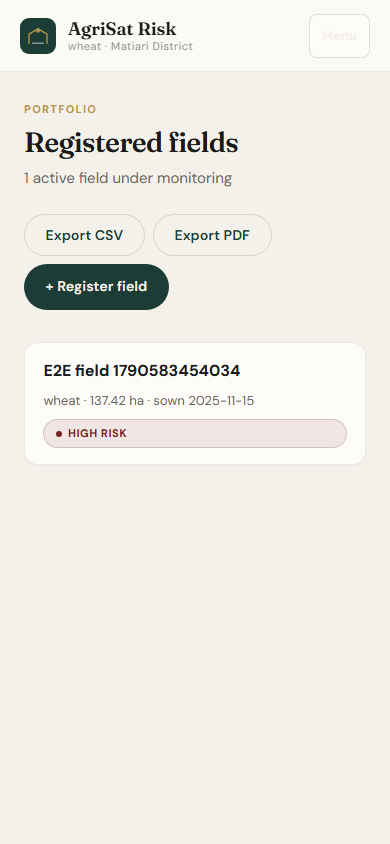
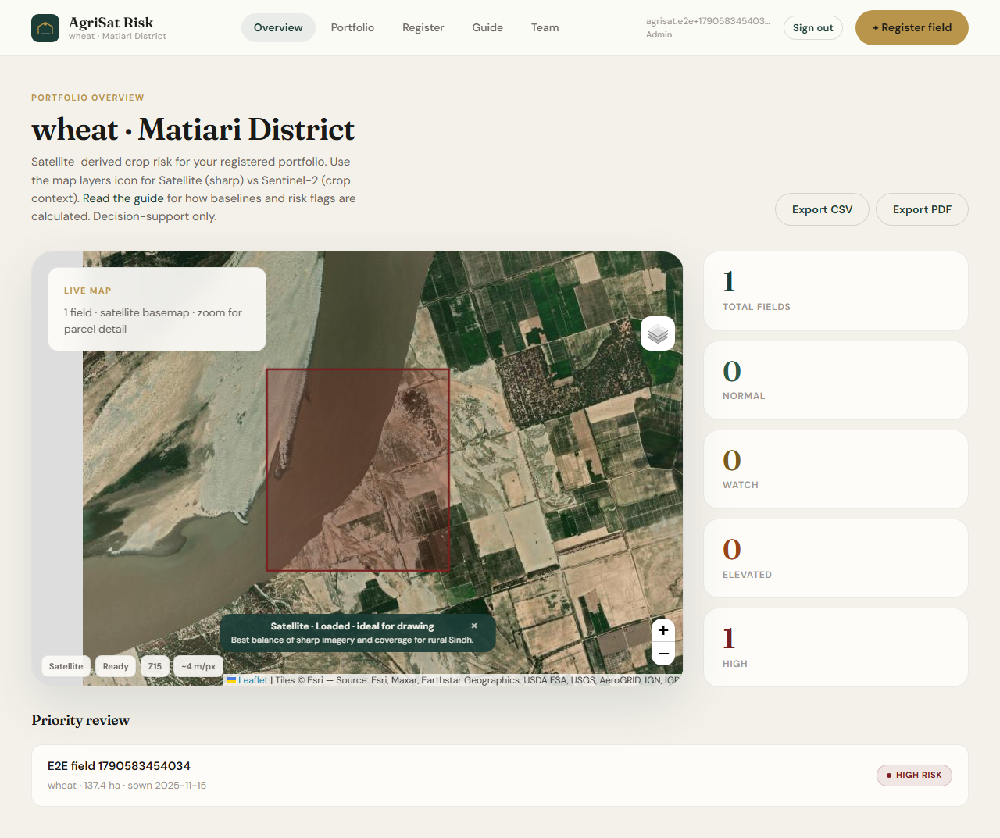

# Live Walkthrough

Real screenshots from an actual run of the app against the live stack (Supabase + Google Earth Engine) — not mockups. Captured automatically by `frontend/e2e/full-walkthrough.spec.ts` (Playwright), which registers a fresh test institution, registers a field, and clicks through the same screens shown here. For the conceptual explanation of what each screen means, see [`USER-FLOW.md`](USER-FLOW.md); this doc is the illustrated companion.

## 1. Register a field, wait for real satellite processing

A field was registered via a GeoJSON boundary upload near the Indus channel in Matiari District, then the app fetched live Sentinel-1/2 data via Google Earth Engine, compared it against the historical baseline, and computed a risk assessment — all before this page rendered:



Worth pointing out, since it's easy to miss in a screenshot: this field landed **HIGH RISK** because the test boundary happens to sit mostly over the river channel, not cropland — a legitimate result, not a bug. It's a good demonstration that the pipeline actually reacts to what's really on the ground rather than always returning a placeholder value. Also visible: the **ML stress model** note ("predicted tier: watch") correctly did *not* override the z-score's HIGH classification — a live confirmation that the elevate-only design (see `docs/USER-FLOW.md` §7) behaves as documented: the ML layer can only push risk up, never down, and here it had nothing to add since the z-score was already higher.

The satellite thumbnails themselves are sharper than an earlier version of this screenshot — Sentinel-2's visible bands are natively ~10m/pixel, and sampling a field at that scale directly (the old behavior) produced arrays as small as a few dozen pixels per side, stretched to fill the display. `gee_imagery.py` now resamples server-side (bicubic, in GEE) to a scale chosen from the field's own footprint, applies a per-band contrast stretch to the scene's actual reflectance range instead of one fixed window, and finishes with a light sharpening pass. All of that works on the real sampled pixels — it's display-quality processing, not a learned/hallucinated reconstruction, so what you see is still a faithful (if smoothed) rendering of the actual Sentinel-2 data, not invented detail.

## 2. Portfolio — desktop

`docs/AUDIT-FINDINGS.md` item #20 asked whether the fields-list page's dual card/table markup (one for mobile, one for desktop, toggled by a CSS media query) actually behaves correctly rather than both rendering at once. Confirmed live at 1280px width — the table renders, the card list doesn't:



## 3. Portfolio — mobile

Same page, same data, reloaded at 390px width (an iPhone-sized viewport) — the card list renders instead, and the table is gone, not just visually hidden:



This closes out #20: the toggle is genuinely mutually exclusive in a real browser, not just in the CSS source. The only remaining note is that it's two markup blocks for one dataset (a DRY nit), not a functional bug — see `docs/AUDIT-FINDINGS.md` for the final disposition.

## 4. Dashboard overview

The portfolio-wide view — live map, risk-tier counts, and a "Priority review" list surfacing the field that needs attention:



## How to reproduce this yourself

```bash
cd backend && uvicorn app.main:app --port 8000    # separate terminal, needs backend/.env configured
cd frontend && pnpm run e2e                        # runs the walkthrough spec, regenerates these screenshots
```

See [`frontend/e2e/README.md`](../frontend/e2e/README.md) for prerequisites and what this test does and doesn't assert.
